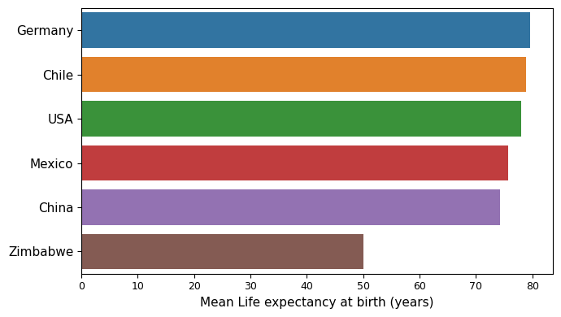

# How environment affects our lifespan?

## Problem introduction

How to live a long and happy life? Isn't this an old question people have been asking themselves for a long time in our civilization?

Is there a simple answer to this question?

A lot of scientific studies shows that a large number of factors affect human longevity. Some of them are physical like quality of air and food, weather, atmospheric pressure etc. Others are psychological (person's mindset, communication quality with our closest relatives and at work) and cultural. Some factors influence us directly, other - indirectly. Some factors have immediate effect, some other - delayed. Also, some factors are interrelated with each other, and we can say with full confidence: the situation is very complicated.

It is impossible to distinguish only one or few factors and use them as a basis to develop the strategy for long and healthy life.

However, statistics may provide a general approach to solve complicated problems. Among other, statistics define and aggregate parameters which can sum up effects of several factors into one-number estimation.

## Research approach

Statistically, expected lifespan can be described as **life expectancy at birth** (LEAB): how long, on average, a newborns are expected to live, if current death rates do not change. Technically, it is an estimation of newbon's lifespan, not it's actual average years of life [^1].

An aggregate parameter, which encompass a lot of factors influenced out environment, is country's **gross domestic product** (GDP): the total monetary or market value of all the finished goods and services produced within a country’s borders in a specific time period. GDP describes the particular country's life environment since not only GDP defines the level of life, but also citizens of the coutry, living their life, contribute to GDP.

If environment affects lifespan, then statistics must show a relationship between these two parameters. Naturally, if we are looking for a relationship between LEAB and GDP only - we must only compare these parameters within each country.

## Data

The data for this project has been provided by Codecademy. The data contains LEAB and GDP statistics for six countries: Chile, China, Germany, Mexico, United States of America, Zimbabwe. The range of years covers the period from 2000 to 2015 for all countries, no missing records found.

The data show clear differences between countries. Though the sample is small, we have here a good variety in GDP and some different LEABs.

### Life expectancy at birth

Five countries out of six have a comparable mean life expectancies around 75 years. The only outlier is Zimbabwe where average life expectancy is smaller for almost 20 years.

The dynamics of variable is best seen in line plots. All countries show increase of life expectancy in the considered time period. Most of the countries show small life expectancy increase for about 2..3 years. Larger values observed for China (+4.4 years) and Zimbabwe (+16.4 years).

### GDP

[^1]: https://blogs.worldbank.org/opendata/what-does-life-expectancy-birth-really-mean

