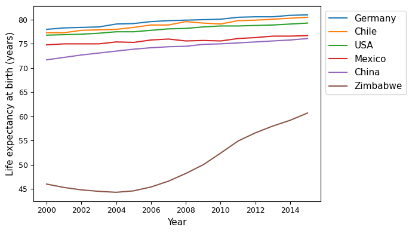
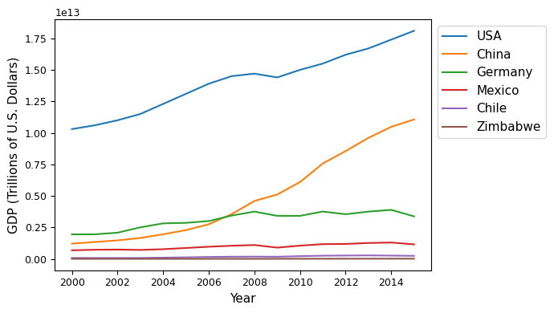
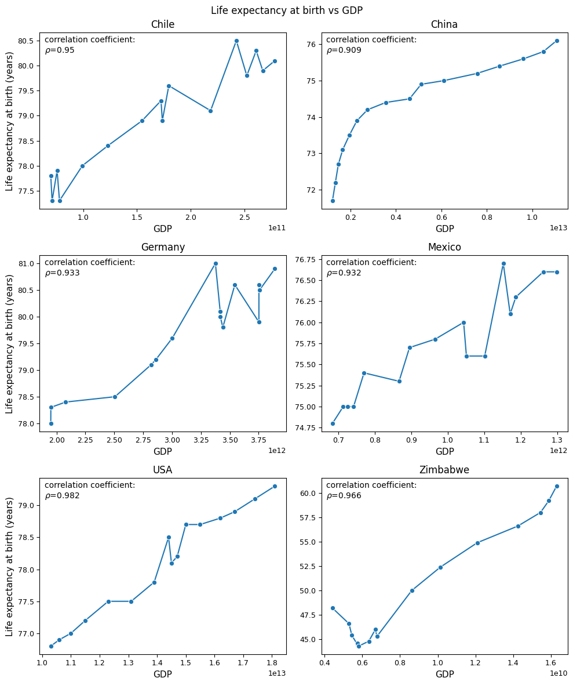

# Relationship between Life expectancy at birth and gross domestic product in six countries

## Project motivation

This is one of the short projects I made during the training on the course "Data Scientist: Machine Learning" at Codecademy.

## Definitions

**Life expectancy at birth** (LEAB): how long, on average, a newborns are expected to live, if current death rates do not change. Technically, it is an estimation of newbon's lifespan, not it's actual average years of life [^1].

**Gross domestic product** (GDP): the total monetary or market value of all the finished goods and services produced within a country’s borders in a specific time period. GDP describes the particular country's life environment since not only GDP defines the level of life, but also citizens of the coutry, living their life, contribute to GDP.

## Data

The data for this project has been provided by Codecademy. The data contains LEAB and GDP statistics for six countries: Chile, China, Germany, Mexico, United States of America, Zimbabwe. The range of years covers the period from 2000 to 2015 for all countries, no missing records found.

The data show clear differences between countries. Though the sample is small, we have here a good variety in GDP and some different LEABs.

### Life expectancy at birth

Five countries out of six have a comparable mean life expectancies around 75 years. The only outlier is Zimbabwe where average life expectancy is smaller for almost 20 years.

The dynamics of variable is best seen in line plots. All countries show increase of life expectancy in the considered time period. Most of the countries show small life expectancy increase for about 2..3 years. Larger values observed for China (+4.4 years) and Zimbabwe (+16.4 years).

### GDP

There is a large difference in GDP among all countries. The distance between lowest country's GDP and largest is three orders of magnitude.

All countries show increase of their GDP in the considered time period. Most of the countries increased their GDP for about 75..300%, and China shows the largest increase of 813%.

## Life expectancy at birth and GDP relationship

Large positive correlation coefficient between LEAB and GDP has been found for all countries considered in this project.

The larger is country's GDP - the longer is Life expectancy of the country's citizens. For Chile, Germany, Mexico and USA the Life expectancy - GDP relations visually resemble linear dependencies. In case of China it may be a kind of power function. Zimbabwe shows change of trend at GDP 0.6 billion from down to up.

## Conclusion

Life expectancy at birth is in strong relationship with GDP in the six considered countries. Еhis fact may indicate that GDP may encompass or influence on some factors that, in turn, influence the citizen's lifespan.

## Limitations of the data and possible further research

In this research only six countries were shown which is a small sample. Other countries can also be explored, which would certainly enrich the study.

Interesting insights can be found in inter-country study where some particular factors affecting lifespan may be found.

[^1]: https://blogs.worldbank.org/opendata/what-does-life-expectancy-birth-really-mean

